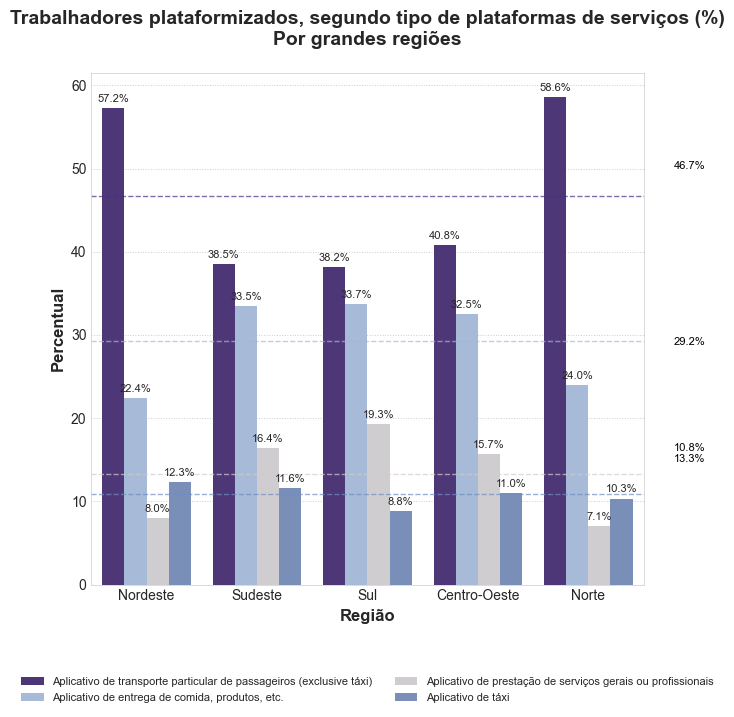

Este projeto realiza a extração, processamento estatístico e visualização dos microdados da **PNAD Contínua (Pesquisa Nacional por Amostra de Domicílios Contínua)** do **IBGE**. O foco da análise é reproduzir e analisar a distribuição dos trabalhadores plataformizados (aplicativos de transporte, entrega e serviços) por Grandes Regiões do Brasil.

---

## 📊 Visualização Gerada

O pipeline gera uma replicação gráfica fiel às publicações analíticas do IBGE:



* **Gráfico de barras agrupadas** com as quatro categorias de plataformas em cada Grande Região.
* **Rótulos de dados (%)** nas barras para leitura direta.
* **Linhas de referência (médias nacionais)** indicando a proporção geral de cada tipo de serviço no país.

---

## 📁 Estrutura do Projeto

O código é organizado segundo uma arquitetura modular em camadas:

```text
pnad_continua_analise/
├── relatorios/
│   └── grafico_exemplo_replicado.png   # Gráfico de saída gerado
├── src/
│   ├── controllers/
│   │   └── main_controller.py         # Orquestra leitura, ponderação amostral e plot
│   ├── models/
│   │   ├── data_loader.py              # Leitor otimizado de dados de largura fixa (FWF)
│   │   ├── data_processor.py           # Processamento e transformações de dados
│   │   └── analysis.py                 # Funções analíticas e estatísticas
│   └── views/
│       └── plot_generator.py           # Geração e estilização visual com Matplotlib/Seaborn
├── .gitignore                          # Ignora arquivos de dados e binários
├── main.py                             # Script de execução principal
├── requirements.txt                    # Dependências do projeto
└── README.md                           # Documentação do projeto
```

---

## 📋 Variáveis da PNAD Utilizadas

Para otimizar o tempo de carga e uso de memória, o leitor ([`data_loader.py`](src/models/data_loader.py)) extrai apenas as posições correspondentes às variáveis de interesse do arquivo de microdados de largura fixa:

| Código PNAD | Descrição | Coluna Interna | Posições no Dicionário |
|---|---|---|---|
| **UF** | Unidade da Federação | `UF` | 5 a 7 |
| **V1028** | Peso do morador com calibração | `peso` | 49 a 64 |
| **S140091** | Aplicativo de táxi | `app_taxi` | 681 a 682 |
| **S140092** | Aplicativo de transporte particular de passageiros (exclusive táxi) | `app_transporte_passageiros` | 682 a 683 |
| **S140093** | Aplicativo de entrega de comida, produtos, etc. | `app_entrega_produtos` | 683 a 684 |
| **S140094** | Aplicativo de prestação de serviços gerais ou profissionais | `app_servicos_gerais` | 684 a 685 |

---

## 📐 Metodologia de Cálculo

1. **Mapeamento Regional**: As Unidades da Federação (`UF`) são mapeadas nas cinco Grandes Regiões: *Norte, Nordeste, Sudeste, Sul e Centro-Oeste*.
2. **Expansão Amostral**: Os valores são calculados considerando o peso amostral (`V1028`) de cada indivíduo que respondeu afirmativamente (`Sim`) ao uso da respectiva plataforma.
3. **Distribuição Percentual por Região**: Para cada região, calcula-se o percentual de ocorrência de cada aplicativo em relação ao somatório de todas as respostas afirmativas de plataformizados daquela mesma região.
4. **Linhas de Média**: A média de cada aplicativo entre as regiões é calculada e destacada no gráfico com linhas tracejadas e marcadores numéricos laterais.

---

## 🚀 Como Executar

### 1. Pré-requisitos

* Python 3.9+ instalado.
* Arquivo de microdados da PNAD Contínua (por exemplo, `PNADC_032024.txt` referente ao 3º trimestre).

### 2. Instalação das dependências

Crie e ative um ambiente virtual (opcional, porém recomendado):

```bash
# Criar ambiente virtual
python -m venv .venv

# Ativar no Windows (PowerShell)
.\.venv\Scripts\Activate.ps1

# Ativar no Linux/macOS
source .venv/bin/activate
```

Instale as bibliotecas necessárias:

```bash
pip install -r requirements.txt
```

### 3. Configuração dos Caminhos

No arquivo [`src/controllers/main_controller.py`](src/controllers/main_controller.py), certifique-se de apontar o caminho do arquivo de microdados:

```python
caminho_dados = "caminho/para/seu/PNADC_032024.txt"
caminho_saida = "relatorios/grafico_exemplo_replicado.png"
```

### 4. Execução

Execute o script principal:

```bash
python main.py
```

O gráfico gerado será salvo no diretório `relatorios/`.

